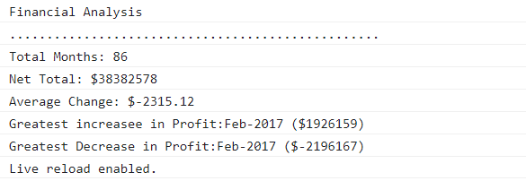

# Console Finances

## Overview
 
 The challenge presents a real-world situation in which JavaScript is employed and used to  create code for analyzing financial records of a company. 

## Functionality
   
From dataset composed of arrays with two fields, Date and Profit/Losses.

JavaScript code is written to analyzes the records to calculate each of the following:

* The total number of months included in the dataset.

* The net total amount of Profit/Losses over the entire period.

* The average of the **changes** in Profit/Losses over the entire period.
  * Also, the total change in profits are from month to month and then find the average is tracked.
  * (`Total/Number of months`)

* The greatest increase in profits (date and amount) over the entire period.

* The greatest decrease in losses (date and amount) over the entire period.

### Completed App

Below are the images of the given criteria and the completed App captured from the console print-out.

  ```text
  Financial Analysis
  ----------------------------
  Total Months: 25
  Total: $2561231
  Average  Change: $-2315.12
  Greatest Increase in Profits: Feb-2012 ($1926159)
  Greatest Decrease in Profits: Sep-2013 ($-2196167)
  ```

  


