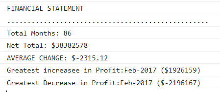

# CONSOLE FINANCES

Console Finances is the challenge #4, using Javascript to create code for the analysis of a company's financial record.

The dataset is provided in the starter code.  This challenge follows a set of instructions in  which the required tax for the code to accomplish is set out.

Below is the consle image showing the result.

